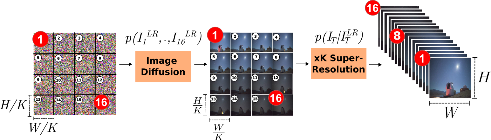

<p align="center">
  <h2 align="center"> GriDiT: Factorized Grid-Based Diffusion for Efficient Long Image Sequence Generation </h2>
  <p align="center">
    <a href="https://snehalstomar.github.io/">Snehal Singh Tomar</a>
    .
    <a href="https://alexgraikos.github.io/">Alexandros Graikos</a>
    .
    <a href="https://www.linkedin.com/in/arjun-krishna-a3573710/">A. Krishna</a>
    .
    <a href="https://www3.cs.stonybrook.edu/~samaras/">Dimitris Samaras</a>
    .
    <a href="https://www3.cs.stonybrook.edu/~mueller/">Klaus Mueller</a>
  </p>
  <p align="center"> <strong>Transactions on Machine Learning Research (TMLR) 2026</strong></p>
  <p align="center">
    Stony Brook University 
  </p>
  <h3 align="center">

  [](https://arxiv.org/abs/2512.21276) 
  [](https://snehalstomar.github.io/projects/gridit_project/index.html)
  [](https://huggingface.co/snehalstomar/GriDiT)
  
 <div align="center"></div>
</p>

<p align="center">
  <a href="">
    
  </a>
</p>

<h5 align="left">
<em>TL;DR:</em> State-of-the-Art image sequence generation models treat image sequences as large tensors of ordered frames.
In contrast, our method factorizes image sequence generation into two stages. First, we learn to model
the dynamics of the sequence at low resolution, treating the frames as subsampled image grids. Second, we
learn to super-resolve individual frames at high resolution. Using the DiT’s self-attention mechanism to model
dynamics across frames, and paired with our sampling strategy, our method yields superior synthesis quality
for sequences of arbitrary length while significantly reducing sampling time and training data requirements.
</h5>

## Setup

```
git clone https://github.com/snehalstomar/GriDiT.git
cd GriDiT/
make setup
conda activate GriDiT
```

## Inference

### Arbitrary length image sequence synthesis using Stage 1:

* Download and place your pretrained stage-1 model of choice from out Hugging Face [repository](https://huggingface.co/snehalstomar/GriDiT) at `ckpts/`.
* Set all flags in `Makefile` per sampling requirements. The flag `NUM_SEQUENCES`, `SAMPLING_FRAMES_LEN`, `CKPT_PATH_INFER_STAGE_1`, and `OUTPUT_DIR` flags denote the desired number of sequences denotes, desired length of each sequence, path to the checkpoint file, and intended output path, respectively.
* run:

```
make sample_long_sequences
```

The sampled sequences shall then be found at `OUTPUT_DIR/splitted_output`.

## Training

* Download and place pretrained weghts viz. `DiT-XL-2-256x256.pt` and `DiT-XL-2-512x512.pt` from DiT's official [repository](https://github.com/facebookresearch/DiT) at `ckpts/pre_trained/`.
* For Stage 1: Use `src/utils/dataset_grid_organiser.py` to converted a training dataset of choice comprising image-sequences stored as frames into grid-images that are suitable for training GriDiT by setting the variables: `dset_dir` and `target_dir`.
* Make appropriate modifications to the variables pertaining to commands in `Makefile` before executing them. 

#### Stage-1 Training:

```
make train-stage-1
```

#### Stage-2 Training:

```
make train-stage-2
```

## Acknowledgements

This repository borrows significantly from, and builds upon the original DiT [repository](https://github.com/facebookresearch/DiT).

## Citation

Please cite our work as:

```
@article{
tomar2026gridit,
title={GriDiT: Factorized Grid-Based Diffusion for Efficient Long Image Sequence Generation},
author={Snehal Singh Tomar and Alexandros Graikos and Arjun Krishna and Dimitris Samaras and Klaus Mueller},
journal={Transactions on Machine Learning Research},
issn={2835-8856},
year={2026},
url={https://openreview.net/forum?id=QLD47Ou5lp},
note={}
}
```